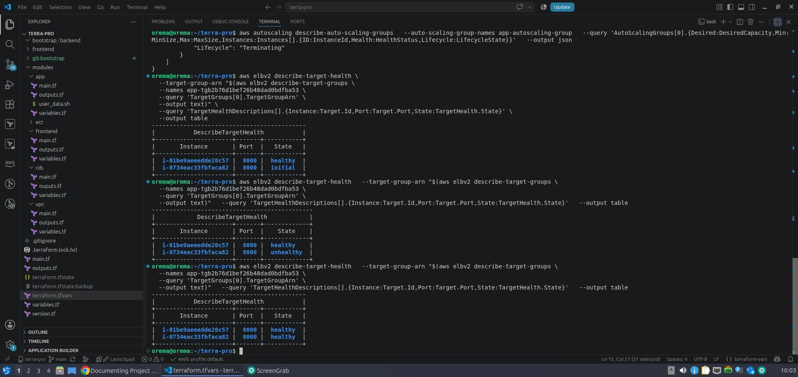
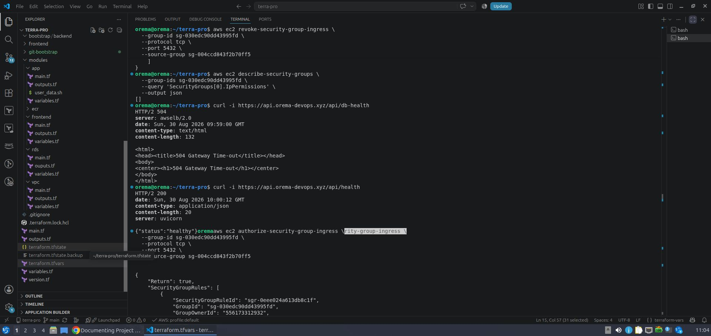
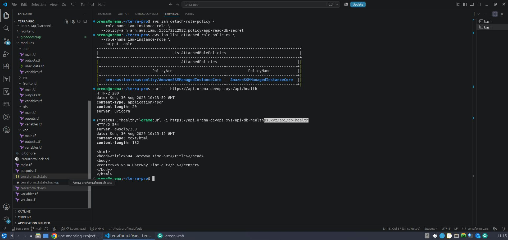

# AWS 3-Tier Architecture | Terraform + CI/CD

A production-style AWS 3-tier application built to demonstrate **Infrastructure as Code, CI/CD, high availability, cloud security, monitoring, and failure recovery**.

The infrastructure is provisioned with **Terraform**, the backend runs as a Dockerized FastAPI application on an **EC2 Auto Scaling Group**, PostgreSQL runs privately on **Amazon RDS**, and deployments are automated with **GitHub Actions and AWS OIDC**.


## Architecture


### Application Flow


Users
  |
Route 53
  |
  +------ CloudFront ------ S3 / React Frontend
  |
  +------ ALB
            |
       Auto Scaling Group
        /             \
   EC2/Docker      EC2/Docker
        \             /
         RDS PostgreSQL
               |
        Secrets Manager


### Deployment Flow


GitHub
   |
GitHub Actions + OIDC
   |
   +--- Terraform
   +--- Docker Build
   +--- ECR Push
   +--- EC2 Deployment
   +--- Health Verification


## Key Features

- **Terraform IaC** — modular infrastructure with remote state
- **High Availability** — multi-AZ EC2 Auto Scaling behind an ALB
- **Containerization** — FastAPI backend packaged with Docker and stored in ECR
- **Managed Database** — private RDS PostgreSQL
- **Secrets Management** — database credentials stored in AWS Secrets Manager
- **Secure CI/CD** — GitHub Actions authenticates to AWS using OIDC
- **Private Administration** — EC2 management through AWS Systems Manager
- **Frontend Delivery** — React/Vite hosted with S3 and CloudFront
- **DNS & HTTPS** — Route 53 with TLS-enabled application endpoints
- **Deployment Validation** — automated application health verification after deployment


## CI/CD Pipeline

Git Push
   ↓
Terraform Plan / Apply
   ↓
Docker Build
   ↓
ECR Push :<git-sha>
   ↓
Launch Template Update
   ↓
ASG Instance Refresh
   ↓
Application Health Check
   ↓
Success / Failure


Docker images use **Git commit SHA tags**, allowing each deployed image to be traced back to its source commit.

AWS access from GitHub Actions uses **OIDC and IAM roles instead of long-lived access keys**.

---

## Security

The architecture uses layered security rather than exposing resources unnecessarily.

- RDS is deployed privately.
- PostgreSQL `5432` is accessible only from the backend security group.
- Database credentials are stored in Secrets Manager.
- EC2 uses IAM roles to retrieve secrets.
- GitHub Actions uses OIDC federation.
- Security groups control communication between application tiers.
- Systems Manager provides instance access without exposing SSH.


## Failure Testing

I intentionally broke parts of the environment to validate recovery behavior and troubleshoot real failure scenarios.

| Test | Failure | Result |

| **EC2 Self-Healing** | Terminated an EC2 instance | ASG automatically launched a replacement |

| **ALB Health Check** | Changed health path to an invalid endpoint | Targets became unhealthy with `Target.ResponseCodeMismatch` |

| **RDS Connectivity** | Removed backend → RDS `5432` access | App stayed alive while DB health returned `504` |

| **Secrets Manager IAM** | Removed secret-read permission | DB-dependent requests failed while the app remained available |

| **Bad Deployment** | Deployed a broken application version | Exposed a missing ASG rollout step |

### Failure Testing Evidence

#### Auto Scaling Self-Healing



The terminated instance was automatically replaced and the new target progressed back to a healthy state.

#### Database Connectivity Failure



Removing the RDS security-group rule caused `/api/db-health` to return `504`, while `/api/health` continued returning `200`.

#### IAM / Secrets Manager Failure



Removing the application's Secrets Manager permission broke database-dependent requests without taking down the FastAPI service itself.

## A Real CI/CD Problem I Discovered

During the bad-deployment test, the pipeline initially reported a healthy application even though I had pushed a broken backend version.

AWS CLI investigation showed:

ASG configured → $Latest
Running EC2    → Launch Template v1
Latest         → Launch Template v5


Terraform had created the new launch-template version, but the existing EC2 instances were still running the previous application.

### Fix

The deployment flow needed an **Auto Scaling Instance Refresh**:


Launch Template Update
        ↓
Rolling Instance Refresh
        ↓
New Instances Become Healthy
        ↓
Post-Deployment Verification


This was an important lesson from the project:

**A successful build, image push, or Terraform apply does not guarantee that the new application version is actually running.**


## Troubleshooting Approach

Rather than immediately changing resources, I used AWS CLI to inspect the actual runtime state first.

```bash
aws autoscaling describe-auto-scaling-groups
aws autoscaling describe-instance-refreshes
aws elbv2 describe-target-health
aws ec2 describe-launch-template-versions
aws ec2 describe-security-groups
aws rds describe-db-instances
aws iam list-attached-role-policies
```

My troubleshooting process became:

Observe → Inspect → Compare → Hypothesize → Change → Verify

This helped isolate problems across **networking, IAM, load balancing, Auto Scaling, database connectivity, and application deployments**.


## Tech Stack

| Category | Technologies |
|---|---|
| **Cloud** | AWS |
| **IaC** | Terraform |
| **CI/CD** | GitHub Actions, OIDC |
| **Containers** | Docker, Amazon ECR |
| **Compute** | EC2, Auto Scaling |
| **Networking** | VPC, ALB, Security Groups, VPC Endpoints |
| **Database** | RDS PostgreSQL |
| **Security** | IAM, Secrets Manager, Systems Manager |
| **Frontend** | React, Vite, S3, CloudFront |
| **Backend** | Python, FastAPI |
| **DNS** | Route 53 |


## What I Learned

This project went beyond provisioning AWS resources. I practiced diagnosing how a system behaves when something goes wrong.

Key areas included:

- EC2 and Auto Scaling lifecycle behavior
- ALB target health and health-check failures
- Security-group troubleshooting
- RDS connectivity
- IAM authorization
- Secrets Manager integration
- Docker image versioning
- Launch-template versioning
- Rolling deployments
- CI/CD health verification
- AWS CLI troubleshooting

## Project Status

✅ Infrastructure provisioned with Terraform  
✅ Application deployed successfully  
✅ CI/CD pipeline operational  
✅ RDS connectivity validated  
✅ Auto Scaling self-healing tested  
✅ IAM and network failures tested  
✅ Deployment health verification tested  
✅ Failure scenarios documented  


## Author

**Oreoluwa Salami**

Aspiring Cloud / DevOps Engineer